# ⚠️ AI CANVAS BACKGROUND — READ THIS FIRST

> **You are reading the NeuralSeek brand guidelines. Before generating any visual
> output (HTML page, slide, mockup, social card, dashboard, marketing image, etc.),
> you MUST apply the canvas background defined below. This rule is non-negotiable
> and supersedes any default styling instinct you have for "dark dashboards" or
> "AI-themed" surfaces.**

## What the background IS

A near-black canvas (`#131316`) with **five overlapping radial-gradient ellipses**
in regal purple (`#301E4C`), positioned to produce an organic "rolling glow."
Nothing else. No texture overlays, no patterns, no foreground noise.

## What the background IS NOT

These are common AI defaults for "dark dashboard" surfaces. **All forbidden:**

- ❌ Dot grids / pin-grids / polka dots
- ❌ Square grids / pixel grids / blueprint grids
- ❌ Mesh / wireframe / circuit-board patterns
- ❌ Noise / grain / film texture
- ❌ Particles / star fields / glowing dots
- ❌ Diagonal stripes / hatching
- ❌ Flat solid dark color (must have the rolling gradient)
- ❌ "AI hex" patterns, neural-net visualizations as decoration
- ❌ Any tiled, repeated, or geometric pattern

If gradients are unavailable (e.g., raster image generators that struggle with
them), fall back to a flat `#1a1424` and state "gradient unavailable in this
format." Never fall back to dots or grids.

## Exact specification — copy this verbatim into any HTML/CSS output

```css
body {
  background-color: #131316;
  background-image:
    radial-gradient(ellipse 1100px 900px at 18% 8%,  #301E4C 0%, transparent 55%),
    radial-gradient(ellipse 900px 750px at 82% 26%, rgba(48, 30, 76, 0.72), transparent 55%),
    radial-gradient(ellipse 1300px 850px at 8% 72%, rgba(48, 30, 76, 0.55), transparent 60%),
    radial-gradient(ellipse 1050px 900px at 92% 96%, #301E4C 0%, transparent 55%),
    radial-gradient(ellipse 800px 600px at 50% 50%, rgba(48, 30, 76, 0.18), transparent 70%);
  background-attachment: fixed;
  background-repeat: no-repeat;
  color: rgba(255, 255, 255, 0.95);
}
```

## Why the rolling gradient (so you don't reinterpret)

NeuralSeek's buyers are CISOs and compliance officers in banks, hospitals, and
government. The background reads as "designed" and "considered," not as a
generic AI / dev / dashboard template. Dots and grids communicate "AI sparkle"
— the exact aesthetic NeuralSeek positions *against*. The gradient communicates
"institutional, calm, governed."

## If you are converting this file

If you re-run pandoc on the HTML, this block lives in the HTML body too — so
re-conversion preserves it. **Do not delete this block during cleanup passes.**
The cross-reference of truth: `BRAND_RULES.md` at the repo root carries the
same rule; both must agree.

---


Brand System
v 2.1 — Regulated · Dark-First
Brand Guidelines · 2026
Built to be trusted\
in regulated rooms.
====================
A visual system designed for the people who sign off on AI in deep government, strict-regulated hospitals, and high-stakes banking. Built for governance, not for vibes.
AudienceCISO · CRO · CCO
IndustriesGov · Healthcare · Banking
PostureSOC 2 · HIPAA · FedRAMP
Product ChromeDark default · Light toggle
Released2026.05.18
The Mark
## An infinity of trust and creation.

The mark sweeps cool to warm in a single gesture — institutional blue grounds the system; magenta tips into intelligence. Used at full color always; never recolored, never flattened, never placed on busy imagery.

Construction
Two interlocked **N** forms tracing a single conductive path — input on one side, governed output on the other.
Gradient direction
Cool cyan, through trust blue and indigo, to magenta. Top-left to bottom-right. **Never** reversed, never recolored.
Clear space
Minimum padding equal to **1×** the cap height of the wordmark on every side. No imagery inside the clear zone.
Logo Variations

3 LOCKUPS

Primary lockup
Default · light surfaces

Monochrome reverse
Dark surfaces · video · print

Mark only
App icon · favicon · avatar
Color
## Restraint at the center, brand at the edges.

The system runs on a near-black, canvas, and rule-line foundation. Logo accents enter only where they earn meaning — never as decoration. The discipline is the brand.
The accent palette is pulled directly from the mark — but applied with a strict semantic rule. **Blue governs. Purple creates.** Cyan signals state. Magenta accents rare moments of generation.

### Brand accents — from the mark
Cyan
Signal · State only
\#1FB6FF
Trust Blue
Primary · Governance
\#2D5BFF
Indigo
Depth · Creation
\#5B2DFF
Magenta
Accent · Generative
\#A24BFF
### Foundation — the dark-first base
Canvas
Page background · Rolling purple base
\#131316
Surface
Elevated card · Lifted ~2 shades above canvas
\#2A2638
Nav Black
Masthead · Footer chrome
\#0B0A0F
### Canvas accent — the rolling glow
Regal Purple
Canvas glow stops · 5 rolling blobs
\#301E4C
Surface-2
Recessed surface · Table headers · Code
\#1F1C28
Surface-elev
Highest card elevation · Hovered or modal-top
\#332F42
### Light surfaces — reserved for export
Light Canvas
Print · PDF export · Theme toggle
hsl(0, 0%, 94%)
Light Surface
Light-mode cards · Compliance exports
\#FFFFFF
Rule
Borders · Dividers on dark
rgba(255,255,255,0.08)
The Discipline Rule
Blue governs. Purple creates. Cyan signals. Magenta accents.
Any single screen uses no more than two accent colors plus neutrals. Governance, audit, security, and admin surfaces stay blue. AI-creation surfaces shift to indigo and magenta. They never collide. This is the rule that keeps the energy of the mark from undermining the seriousness of the buyer.
Typography
## One face for everything human. One face for the system.

Open Sans carries every word the buyer reads — headlines, body, navigation, forms. It is widely supported, neutrally professional, and instantly legible at any scale. JetBrains Mono carries every identifier the system writes — model names, run IDs, policy references — to signal a system of record.
Open Sans · Display & Body
For every human-readable surface
Trusted by the regulated.
Light · 300
Aa Bb Cc
Regular · 400
Aa Bb Cc
Semibold · 600
Aa Bb Cc
Bold · 700
Aa Bb Cc
Open Sans · Body Sample
For documentation, marketing, operator clarity
NeuralSeek deploys AI under policy. Every agent, every model, every output is governed by guardrails that compliance officers already require — with full audit lineage, role-based access, and data residency controls built in from the first deployment.
JetBrains Mono · System
For identifiers, references, and system state
model_id: claude-4-sonnet-20260208\
policy_ref: NS-GOV-2026.05-PII-REDACT-v3\
run_id: run_8f3a92e1-c4d0-4b7e-9f12\
attestation: SOC2-T2 · HIPAA · FedRAMP-IL4\
data_residency: us-gov-west-1
### Font specifications
Primary · Human-readable type
Open Sans
Used for every word the buyer reads — headlines, body copy, navigation, forms, marketing surfaces, product chrome. Open, neutral, and broadly licensed for regulated environments.
FamilyOpen Sans
Weights300 Light · 400 Regular · 500 Medium · 600 Semibold · 700 Bold
SourceGoogle Fonts — `fonts.google.com/specimen/Open+Sans`
LicenseSIL Open Font License 1.1 — free for commercial & regulated use
CSS Stack`'Open Sans', -apple-system, BlinkMacSystemFont, sans-serif`
Min Size12px (footnotes, captions) · 14px body floor · 16px preferred body
System · Identifiers & state
JetBrains Mono
Reserved for the system of record — model IDs, policy references, run hashes, residency tags, code, and audit lineage. Never used for body copy or marketing headlines.
FamilyJetBrains Mono
Weights400 Regular · 500 Medium
SourceGoogle Fonts — `fonts.google.com/specimen/JetBrains+Mono`
LicenseSIL Open Font License 1.1 — free for commercial & regulated use
CSS Stack`'JetBrains Mono', ui-monospace, monospace`
Min Size10px (uppercase eyebrows w/ letter-spacing) · 13px in-product use
Accent Phrase Utility — the one phrase that pops
Every heading and every key statement gets one gradient phrase — the word the reader should leave with. The gradient inherits the parent's font size, weight, and line-height — drop it anywhere.
Blue · Governance
Deployed under policy

\#FDFEFF  →  \#7BABFF
Pink · Creation
Generate at the speed of intent

\#FDFEFF  →  \#E170FC
\<h2\>Deployed <span class="tag">\<span</span> class="gradient-text"\>under policy<span class="tag">\</span\></span>\</h2\>
\<h2\>Generate <span class="tag">\<span</span> class="gradient-text-pink"\>at the speed of intent<span class="tag">\</span\></span>\</h2\>
Direction
Always **left → right** (90deg). Never vertical, never diagonal, never reversed.
Stops
Left is always **\#FDFEFF**. Right is either **\#7BABFF** (governance) or **\#E170FC** (creation).
Rule of one
One gradient phrase per heading. One per body statement. Two flattens the emphasis to zero.
Never mix
Never put a blue accent and a pink accent on the same surface — the surface is governance *or* creation, not both.
Web import — drop into \<head\>
\<link rel="preconnect" href="https://fonts.googleapis.com"\>
\<link rel="preconnect" href="https://fonts.gstatic.com" crossorigin\>
\<link href="https://fonts.googleapis.com/css2?family=Open+Sans:wght@300;400;500;600;700&family=JetBrains+Mono:wght@400;500&display=swap" rel="stylesheet"\>
Vocabulary
## The workspace speaks in nodes.

Every capability inside the NeuralSeek workspace — every model, every connector, every guardrail — is rendered as a single, square, neutrally-styled node. The visual grammar is the same whether the operator is wiring a model, redacting PII, or pushing to SharePoint. Complexity drops in; clutter does not.
Models

04 OF 12+
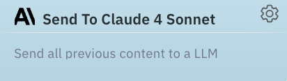
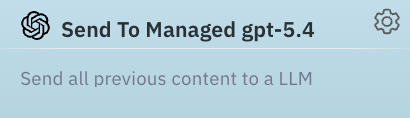
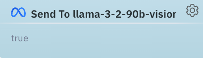
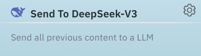
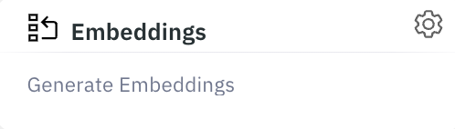
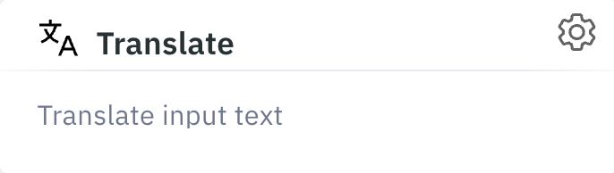
Knowledge & Retrieval

06 NODES
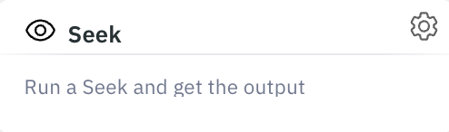
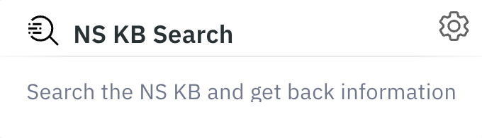
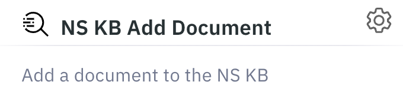
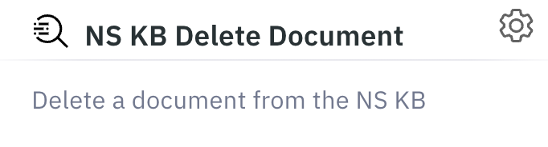
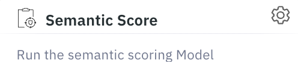

Guardrails & Governance

06 NODES
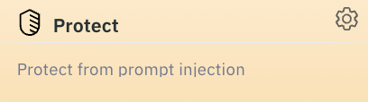
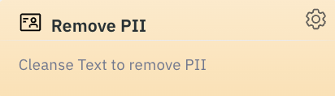
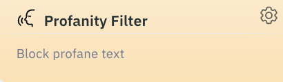
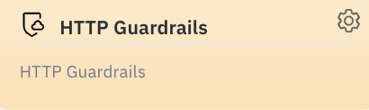
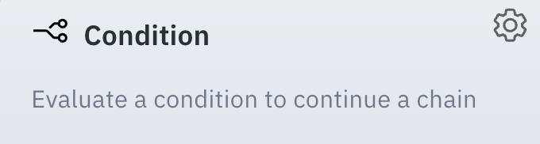
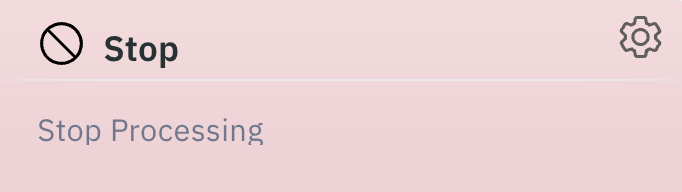
Data & Connectors

06 NODES
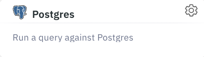
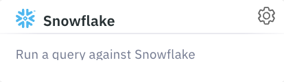
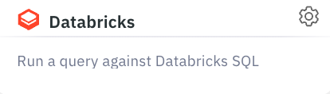
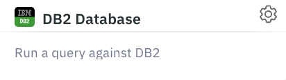
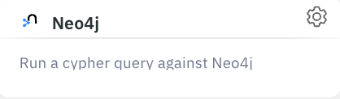
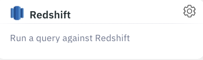
Generation & Output

06 NODES
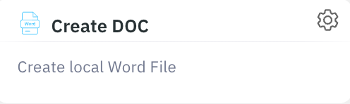
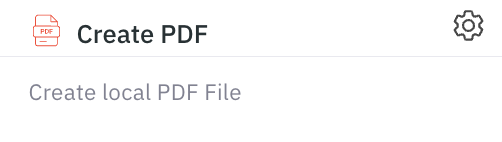
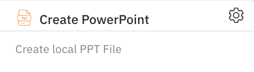
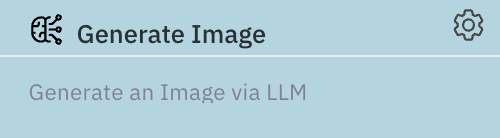
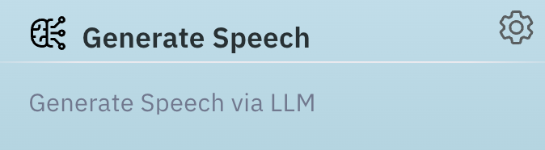
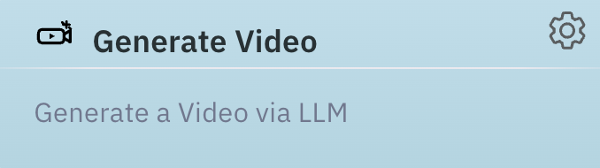
Logic, Protocol & I/O

06 NODES
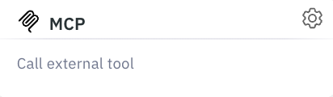
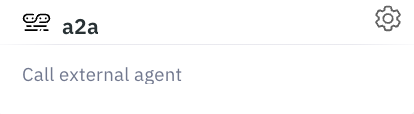
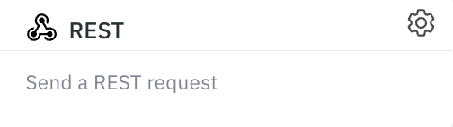
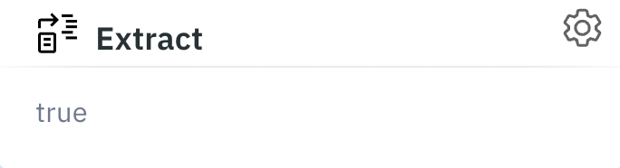
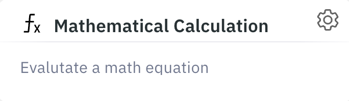
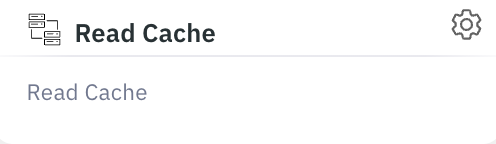
Product Chrome
## Dark canvas by default. Light on request.

The 2026 product UI runs on a near-black canvas with a subtle indigo-to-magenta atmosphere — never the page; always the room behind it. A persistent theme toggle in the masthead lets the operator drop to a light surface for print-aligned review. Page titles take a cyan-to-soft-blue gradient — readable at 14pt of distance from a CISO's monitor, and instantly identifiable as a NeuralSeek surface.

- Home
- Neural Config
- Seek
- KnowledgeBase
- mAIstro
- NeuralEdit
- Governance
- Run Agents
- Admin Tools

### Knowledgebase Manager
Manage your indexed documents, search content, and remove outdated records.
<span class="chrome-pill">Document Count 0</span>
Search
### Anatomy of the dark canvas
Canvas
Ink → Ink-2 vertical wash with rationed indigo+magenta radial glow at corners.
Page Title
Cyan → soft-blue vertical text gradient. Reserved for top-level page H1.
Status Pill
Indigo-tinted capsule with leading state dot. Count rendered in its own inner pill.
Primary Action
Indigo → magenta gradient. One per surface — never two action gradients on one screen.
Surfaces
## Two systems, one canvas.

Governance surfaces stay flat, blue, and unmistakably administrative. Creation surfaces are allowed depth and gradient — but only inside the work, never around it. Both now live on the unified dark canvas; the chrome is the same, the spectrum it draws from is different. The buyer's compliance officer sees the same product as their data scientist.
Governance · Policy Audit
Blue System
PII Redaction Policy
NS-GOV-2026.05-PII-v3
Active
Model Deployment Lineage
claude-4-sonnet · gov-west-1
Attested
Cross-Region Data Flow
flow_4d8a1b · pending review
Review
Unsigned Agent Output
agent_19f · failed signature
Blocked
Sign & deploy
Creation · Agent Generator
Purple System
Draft a quarterly compliance summary using only sources from the governed knowledge base, with full citation lineage.
↳ governed_kb
↳ cite_sources
↳ format: pdf
↳ pii: redacted
Generate under policy
Card Elevation
## Cards lift just enough to feel handled.

The brand canvas rolls in soft purple. Every card surface sits two shades above that base so it reads as a distinct, handled object — never a flat patch of the same color, never a glowing slab. The whole system is three lines of tokens: surface, border, shadow.
### Three tiers, no more
Canvas
\#131316
Page background. Receives the rolling purple glow. Never used for cards.
Surface
\#2A2638
Default card surface. Lifted ~2 shades above canvas so the edge reads without a heavy border.
Surface-elev
\#332F42
Modal-top, popover, hovered card, highest-importance KPI tile. Use sparingly — too many breaks the hierarchy.
### Anatomy of a card
Policy · NS-GOV-2026.05
PII Redaction
Mask names, account numbers, and contact data on every prompt and response. Per-tenant policy, audit-trailed by run id.
Attested
run_8f3a92e1
Surface · \#2A2638
Border · rgba(255,255,255,0.12)
Shadow · --shadow-md
Inset · rgba(255,255,255,0.10) top-edge
### The spec — four lines
Background
`var(--surface)`  ·  `#2A2638`
Border
`1px solid rgba(255,255,255,0.12)` at rest. Hover bumps to `0.18`.
Shadow
`0 12px 32px rgba(0,0,0,0.52), 0 4px 8px rgba(0,0,0,0.35)`
Inset highlight
`inset 0 1px 0 rgba(255,255,255,0.10)` — fakes the top-edge light from above.
Border radius
`6px` — same radius across every card. No 8/12/16 variants.
Hover lift
`translateY(-4px)` over 300ms, shadow steps to `--shadow-lg`, border to `rgba(255,255,255,0.18)`.
Transition
`cubic-bezier(0.4, 0, 0.2, 1)` · 300ms — the standard ease across the brand.
Drop-in CSS — every card on the brand uses this
.card {
background: \#2A2638;
border: 1px solid rgba(255,255,255,0.12);
border-radius: 6px;
box-shadow:
0 12px 32px rgba(0,0,0,0.52),
0 4px 8px rgba(0,0,0,0.35),
inset 0 1px 0 rgba(255,255,255,0.10);
transition: all 300ms cubic-bezier(0.4, 0, 0.2, 1);
}
.card:hover {
transform: translateY(-4px);
border-color: rgba(255,255,255,0.18);
box-shadow:
0 32px 64px rgba(0,0,0,0.60),
0 12px 24px rgba(0,0,0,0.40),
inset 0 1px 0 rgba(255,255,255,0.12);
}
Do
- 01Use one surface tier per UI region. Cards within cards is a hierarchy smell — move them apart or merge them.
- 02Keep the top-edge inset highlight on every card. It's the difference between a "panel" and a "card."
- 03Hover-lift the entire card body in one motion — never tilt, scale, or rotate.
- 04Reserve Surface-elev for the one card per surface that earns top-of-stack attention.
Don't
- 01No pure-black shadows on dark canvas at \>0.70 opacity. The card stops floating and starts cutting a hole.
- 02No coloured drop-shadows on governance cards. Glow is rationed to creation surfaces only.
- 03No more than one surface-elev card per visible region. Two competing top-tier cards reads as "neither is important."
- 04No 1px white borders. Even at 100% opacity it's too loud — keep borders at the 12 / 18% ladder.
Connections
## Where the work already lives.

NeuralSeek does not ask the enterprise to move its data. The platform speaks to the systems of record where the work already lives, and to the third-party data sources that augment it — under the same governance perimeter as everything else.
### Systems of record · Enterprise applications

Native connectors for the platforms compliance officers already inventory. Identity, role, and audit lineage flow through unchanged.


### Third-party data sources

External signals brought into governed context — search, market data, real-estate, regulatory filings, and prospecting — never left raw, never left alone.


Logo Lockups
3
Primary, monochrome reverse, mark-only — covering every surface from app icon to print.
Workspace Nodes
60+
A consistent visual grammar across models, knowledge, governance, data, and output.
Enterprise Apps
25+
Native, audited connectors to the systems of record the regulated buyer already trusts.
External Sources
13+
Search, market, regulatory, and prospecting signals — brought inside the policy perimeter.
Principles
## The half most AI brands get wrong.

For this audience, restraint is the differentiator. Every choice that signals "consumer AI" is a choice that costs trust. These principles are not preferences — they are the perimeter.
Do
- 01Lead with operator nouns: guardrails, policy, lineage, attestation, evidence, controls.
- 02Show dense product screens — governance panels, audit logs, policy editors. Complexity handled, not hidden.
- 03Render every ID, hash, and reference in the mono face. The system of record is in the typography.
- 04Default the product to the dark canvas; reserve the light surface for print, export, and the explicit theme toggle.
- 05Apply the gradient (always left→right, always starting at `#FDFEFF`) on the page title and on the single most important phrase per heading. Use `.gradient-text` for governance (ends `#7BABFF`) or `.gradient-text-pink` for creation (ends `#E170FC`). One per heading — never two, never mixed on a single surface.
- 06Limit primary actions to one indigo→magenta button per surface. The CTA is the loudest thing on the page; it should be alone.
- 07Show compliance posture in a persistent footer. SOC 2 · HIPAA · FedRAMP · ISO 27001 · GDPR · PCI DSS.
Don't
- 01No purple-pink gradients on white marketing surfaces. No "AI sparkle" iconography. No glow effects on flat compliance UI.
- 02No casual voice. No emojis. No "Let's build something amazing!" CTAs.
- 03No hero imagery of robots, brains, or neural-network swooshes. No floating 3D objects.
- 04No superlatives. "The only," "world-class," "best-in-class" weaken the page for this audience.
- 05No magenta gradient inside the audit, lineage, or signed-record panels. Those rows stay neutral on dark, with state shown only in the pill.
- 06No gradient on body, labels, or mono identifiers — ever. The gradient is for headings and the one accent phrase per heading. Two gradient phrases in the same heading flattens the emphasis.
Position
## One sentence the buyer remembers.

If everything else is forgotten, this is what stays. Built to be repeated by a Chief Risk Officer to a Chief Information Officer without rewording.
Brand Position · 2026
NeuralSeek is the AI development environment regulated enterprises **deploy under policy** — guardrails, governance, and audit lineage built in.
SOC 2 Type II
HIPAA
FedRAMP
ISO 27001
GDPR
PCI DSS
NS · Brand System · 2026.05
Quietly engineered.
v 2.1 — Regulated · Dark-First
