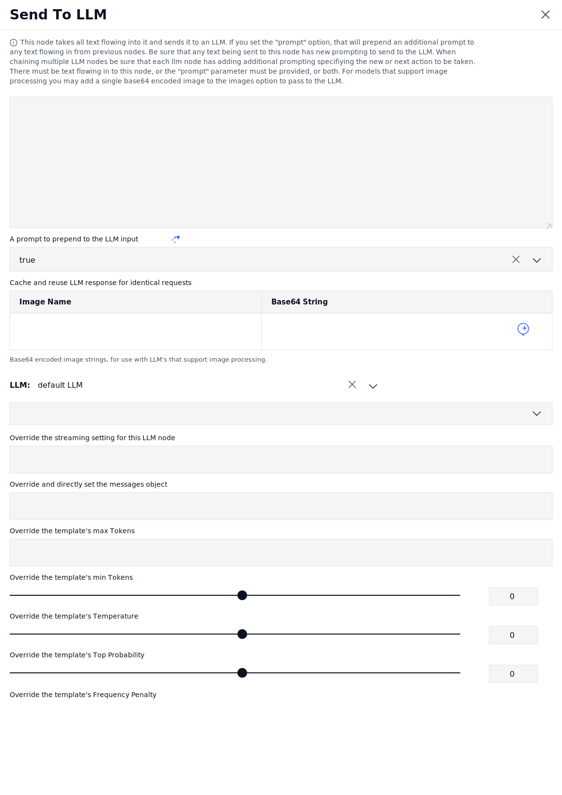

**NEURALSEEK**

**LLM API-Level Tuning**

*How the Send To LLM node controls prompts, generation parameters,
caching, and message overrides on a per-call basis.*

NeuralSeek’s **Send To LLM** node is the API-level integration point
where text from upstream nodes is bundled with optional prompts,
parameters, and image inputs and dispatched to a chosen LLM. Every field
on this node is an opportunity to tune behavior — from response shape to
safety to cost. This document walks through each control and explains
why it matters in production.

**The Send To LLM Node**

The screenshot below shows the full configuration surface for a Send To
LLM node. Each labeled field is described in the sections that follow.

*Figure: Send To LLM node — mAIstro flow editor*

**Prompting & Input**

**Text Input (incoming flow)**

**What it does.** The large text area at the top represents whatever
text is flowing into this node from upstream nodes in the mAIstro flow.
The node will not fire unless either this incoming text or the
prompt-prepend field has a value.

> **Why it matters.** This is the primary message body. In a multi-step
> agentic flow, a previous node’s output (a search result, a
> classification, a transformed query) becomes the next LLM’s input.
> Treat it as the user-turn payload of an OpenAI-style chat call.

**A prompt to prepend to the LLM input**

**What it does.** A static or dynamic prompt that is concatenated to the
front of the incoming text before the call is made. When chaining
multiple LLM nodes, this is where each node’s instruction lives.

> **Why it matters.** Without a fresh prompt at each hop, chained LLM
> calls drift — the model simply re-ingests the previous output with no
> new direction. Setting a clear prepend at every node keeps multi-turn
> reasoning on rails and is the single most reliable lever for steering
> behavior without changing the model.

**Image inputs (Image Name / Base64 String)**

**What it does.** Optional table for attaching a single base64-encoded
image to the request. Only used with multimodal LLMs that accept images.

> **Why it matters.** Multimodal calls cost more per request and only
> work on a subset of providers. Restricting to a single, named image
> keeps the request payload predictable and prevents accidental fan-out
> of image tokens that would blow up cost or time-out the call.

**Caching**

**Cache and reuse LLM response for identical requests**

**What it does.** When set to true, NeuralSeek hashes the full request
(prompt + input + parameters + image) and returns the previously
generated response instead of re-calling the LLM for an exact match.

> **Why it matters.** Identical requests are surprisingly common in
> production — retried webhooks, reloaded pages, deterministic workflow
> steps. Caching converts those into zero-token, sub-millisecond
> responses, which compounds into real cost reduction at scale and
> removes a class of latency spikes from the user experience.

**Model Selection**

**LLM**

**What it does.** Selects which configured LLM connection this node will
call. "default LLM" routes to whichever model is set as default for the
relevant function in the Configure tab; otherwise pick a named
connection (e.g. a specific watsonx.ai or Bedrock provider).

> **Why it matters.** Different steps in a flow benefit from different
> models — a fast, cheap model for classification, a stronger model for
> final generation. Per-node model selection lets you load-balance for
> cost and latency without sacrificing quality where it counts.

**Per-Call Parameter Overrides**

These overrides take precedence over the Configure-tab defaults for this
single node. Leaving them blank inherits the global setting; setting
them locks behavior for this specific call.

**Override the streaming setting for this LLM node**

**What it does.** Forces this node to either stream tokens incrementally
or wait for a full response, regardless of the global streaming
configuration.

> **Why it matters.** Streaming is great for chat UIs (perceived latency
> drops) but useless when the next node in a flow needs the complete
> response before it can act. Per-node control lets you stream to the
> user-facing endpoint while keeping internal flow nodes blocking.

**Override and directly set the messages object**

**What it does.** Bypasses NeuralSeek’s prompt assembly and lets you
pass a raw chat-completion-style messages array (system / user /
assistant turns) directly to the API.

> **Why it matters.** Useful when you need precise control over
> conversation history, system prompts, or function-calling payloads.
> This is an escape hatch — use sparingly, because it sidesteps
> NeuralSeek’s built-in safety prompting and prompt-injection
> mitigations.

**Override the template’s max Tokens**

**What it does.** Caps the number of tokens the LLM is allowed to
generate in its response.

> **Why it matters.** Max tokens is the most direct cost and latency
> control on the call. Set it tight for short classifications or yes/no
> answers; set it generously only for long-form generation. A
> surprisingly common production bug is unbounded max-tokens producing
> 4,000-token responses to questions that needed 20 words.

**Override the template’s min Tokens**

**What it does.** Forces the LLM to produce at least this many tokens
before stopping. Default 0.

> **Why it matters.** Useful when downstream parsing depends on a
> minimum-length response (e.g. a JSON object that must include certain
> fields). Most LLMs will dutifully respond with one token if min is
> unset and the question is trivial — setting a floor avoids edge-case
> truncation.

**Override the template’s Temperature**

**What it does.** Controls randomness in token sampling. 0 is fully
deterministic (greedy); higher values introduce more variation.

> **Why it matters.** Lower temperature = more reproducible answers,
> better for retrieval-augmented Q&A, classification, and structured
> output. Higher temperature = more creative phrasing, better for
> brainstorming or paraphrase. Per-node control lets a flow run
> deterministic for extraction and creative for summarization in the
> same pipeline.

**Override the template’s Top Probability (top-p)**

**What it does.** Restricts token sampling to the smallest set of
candidates whose cumulative probability exceeds top-p.

> **Why it matters.** Top-p and temperature interact — most teams pick
> one as the primary lever and pin the other. Top-p narrows the
> vocabulary the model can draw from, which is an effective way to
> reduce wandering or off-topic content without flattening the
> distribution as harshly as setting temperature to 0.

**Override the template’s Frequency Penalty**

**What it does.** Penalizes tokens that have already appeared in the
response, reducing the likelihood of literal repetition.

> **Why it matters.** In long-form generation, models sometimes loop or
> restate phrases verbatim. A small frequency penalty (0.2–0.5) breaks
> that pattern without degrading quality. Too high and the response
> loses natural cadence; this is a fine-tuning dial, not a default.

**Best Practices**

- **Set a deliberate prompt at every LLM node.** In multi-LLM flows,
  leaving the prepend blank causes drift. Each hop should re-state its
  purpose to the model.

- **Cache by default; bypass only for fresh-data calls.** Caching is
  almost always the right default. Disable it explicitly for nodes that
  depend on changing context (current time, live inventory).

- **Pin temperature to 0 for retrieval / extraction.** Determinism
  matters more than creativity when the answer is grounded in source
  documents. Save temperature \> 0 for explicit summarization or
  rewriting nodes.

- **Use max-tokens as a cost guardrail.** Cap every node to the minimum
  it needs. This is the cheapest abuse-and-mistake mitigation available.

- **Reserve "Override messages object" for true edge cases.** It
  bypasses NeuralSeek’s safety prompting, prompt-injection mitigation,
  and source-attribution scaffolding. Use only when the flow genuinely
  needs raw API control.
