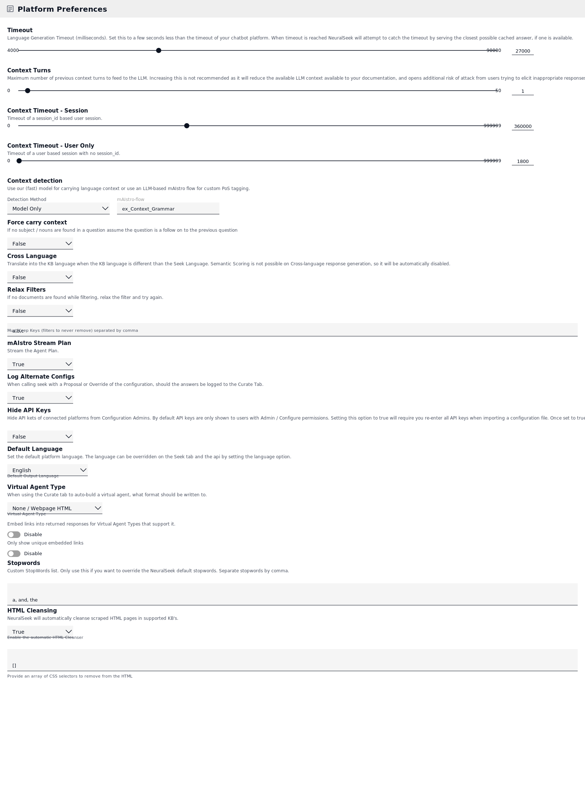
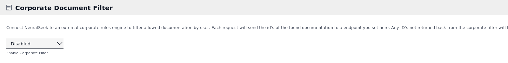
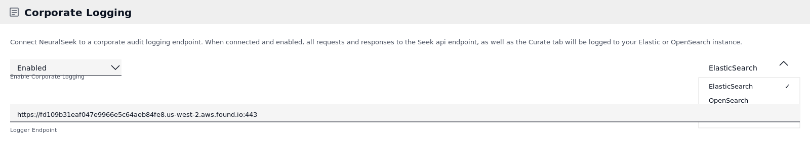
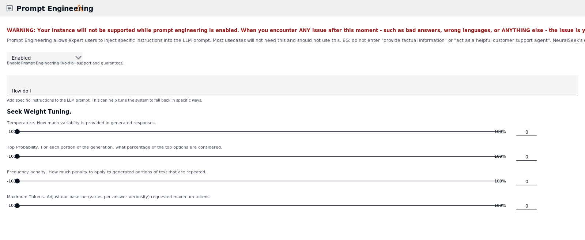
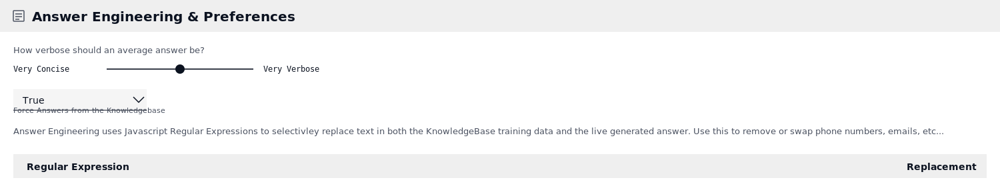
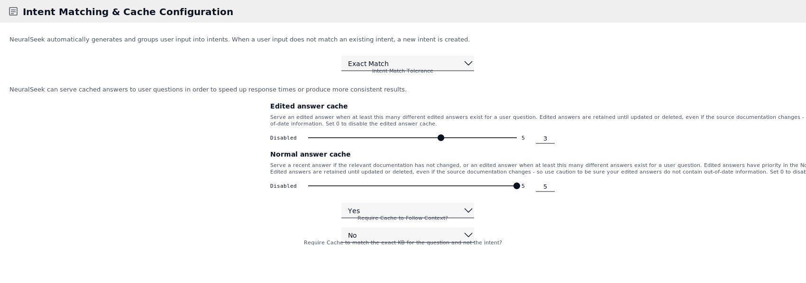
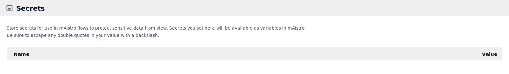

**NEURALSEEK**

**Platform-Level AI Ops Settings**

*A reference for every Configure-tab control that governs how NeuralSeek
behaves at the platform level — timeouts, context, language, caching,
governance, prompt engineering, and secrets.*

**Audience** Administrators, AI Ops engineers, and Solution Architects
responsible for the production behavior of a NeuralSeek instance.

**Scope** Settings that apply globally (or per Multi-Agent Routing
category) — distinct from per-call API parameters set on individual
mAIstro nodes.

**Sections** Platform Preferences · Corporate Document Filter ·
Corporate Logging · Prompt Engineering · Answer Engineering &
Preferences · Intent Matching & Cache · Secrets

**1. Platform Preferences**

Platform Preferences is the broadest panel in the Configure tab. It
covers timeouts and context windows, language behavior, output
formatting, virtual-agent integration, and instance-level security
defaults. Most of these settings ship with sensible defaults — but each
one becomes important the first time it is wrong.

*Figure: Platform Preferences panel*

**Timeouts & Context Windows**

**Timeout**

**What it does.** Language Generation Timeout in milliseconds (e.g.
27000 = 27 seconds). When the LLM does not return within this window,
NeuralSeek attempts to serve the closest cached answer instead of
failing.

> **Why it matters.** Set this 2–5 seconds shorter than the upstream
> chatbot platform timeout. If the upstream times out first, the user
> sees a generic error instead of the cached fallback NeuralSeek would
> have given them.

**Context Turns**

**What it does.** Maximum number of previous turns of conversation
history sent to the LLM with each call.

> **Why it matters.** More context turns mean better follow-up handling,
> but each turn consumes input tokens — eating into the budget available
> for source documents and increasing prompt-injection surface area.
> Production defaults of 1–3 are usually right; raising above 5 is
> rarely worth the trade.

**Context Timeout — Session**

**What it does.** How long (in seconds, here 360,000 = 100 hours) a
session_id-based session is retained. After this window the conversation
context is discarded.

> **Why it matters.** Long session timeouts are useful for stateful
> chatbots where users may walk away and return. Short timeouts are
> safer for kiosk or shared-device deployments where a stale session can
> leak across users.

**Context Timeout — User Only**

**What it does.** Same as above but for sessions that have no session_id
(1,800 sec = 30 min default).

> **Why it matters.** This is the fallback for unauthenticated traffic.
> Keep it short — anonymous-user context that lingers too long is the
> most common source of "why is my chatbot remembering things from
> another visitor" tickets.

**Context detection (Detection Method)**

**What it does.** Choose between the fast built-in model (Model Only) or
a custom LLM-based mAIstro flow for part-of-speech tagging and pronoun
resolution.

> **Why it matters.** Model Only is faster and free; the LLM-based flow
> is more accurate for languages or domains the built-in model handles
> poorly. Switch only if you measure a concrete failure mode in the
> default.

**Force carry context**

**What it does.** When True, if no nouns or subject are detected in a
question, NeuralSeek assumes the user is following up on the previous
turn.

> **Why it matters.** A double-edged sword. Helpful for short questions
> like "what about that?" — but in noisy or multi-user environments it
> can carry irrelevant context forward. Default False unless your
> traffic is genuinely conversational.

**Localization**

**Cross Language**

**What it does.** Translates the user query into the KnowledgeBase
language before search, then translates the answer back. Disables
Semantic Scoring (which can't operate cross-language).

> **Why it matters.** Enables a multilingual front-end on top of a
> single-language KB. Trade-off: losing Semantic Scoring removes a major
> hallucination guardrail, so cross-language deployments rely more
> heavily on KB confidence and explicit minimum-confidence settings.

**Default Language**

**What it does.** Sets the default output language. Can be overridden
per call via the API or Seek tab. "Match input" tries to detect the
user's language and reply in kind.

> **Why it matters.** Set this to the most common user language. "Match
> input" is convenient but adds detection latency to every call — fine
> for international deployments, overkill for monolingual ones.

**Filtering & Output Behavior**

**Relax Filters**

**What it does.** When True and a filtered search returns zero
documents, retries without the filter. The "Must Keep Keys" list names
filters that must never be relaxed.

> **Why it matters.** Useful as a graceful-degradation safety net so
> users never get an empty answer because of an over-tight filter. The
> Must Keep list is critical for security-sensitive filters (tenant ID,
> PII restrictions) that must never be silently dropped.

**mAIstro Stream Plan**

**What it does.** Streams the agent's plan (the intermediate reasoning
steps mAIstro takes) back to the caller in addition to the final answer.

> **Why it matters.** Helpful for debugging and for "show your work"
> UIs. Disable in production endpoints where you don't want the agent's
> internal flow exposed to end users.

**Log Alternate Configs**

**What it does.** When a Seek call uses a Proposal or runtime override,
controls whether the answer is still logged to the Curate tab.

> **Why it matters.** Default True is right for most teams — even
> alternate-config answers are valuable training data. Disable only if
> proposals are used so heavily they would pollute Curate tab analytics.

**Security**

**Hide API Keys**

**What it does.** When True, hides API keys for connected platforms from
Configure-tab admins. Re-importing a configuration file will require
re-entering all keys.

> **Why it matters.** Strongly recommended for shared admin
> environments. The catch: this setting cannot be reversed. Set it once
> you have stable infrastructure, not while you're still rotating
> credentials during setup.
>
> **WARNING**
>
> Once Hide API Keys is set to True, it cannot be disabled. Confirm your
> credential management process can support re-entering all keys when
> importing configurations before flipping this switch.

**Output Format**

**Virtual Agent Type**

**What it does.** When using the Curate tab to auto-build a virtual
agent, sets the export format (None, Webpage HTML, or a specific VA
platform).

> **Why it matters.** Pick the format your downstream chat platform
> actually consumes. Mismatches here are a common cause of "the export
> looks fine but the agent won't import it" issues.

**Embed links into returned responses**

**What it does.** When enabled, NeuralSeek inserts clickable source
links directly into the answer body for Virtual Agent Types that support
markdown or HTML.

> **Why it matters.** Adds source attribution and lets users dig deeper
> without follow-up turns. Disable only if your chat surface mangles
> markdown or if you need link-free plain text.

**Only show unique embedded links**

**What it does.** Deduplicates embedded source links so the same URL
doesn't appear multiple times in one answer.

> **Why it matters.** A small UX polish that matters more than it sounds
> — answers that cite the same article five times look spammy and erode
> user trust.

**Stopwords**

**What it does.** Custom stopwords to remove from queries before search.
Overrides NeuralSeek's default stopword list.

> **Why it matters.** Use sparingly. The default list is well-tuned for
> English; overriding it is a power-user lever for highly specialized
> vocabularies (legal, medical, code) where common words like "and" or
> "the" carry meaning.

**HTML Cleansing**

**What it does.** Automatically strips HTML markup from scraped pages in
supported KBs. The selector array lets you remove specific elements
(nav, footer, ads) before content is indexed.

> **Why it matters.** Without cleansing, scraped pages flood the KB with
> menu and footer text, which then competes with real content for
> relevance. Always enable for web-scraped sources; tune the selector
> list to your sites' templates.

**2. Corporate Document Filter**

Connects NeuralSeek to an external entitlement service. Before returning
any document, NeuralSeek calls your corporate filter endpoint with the
candidate document IDs; only IDs that come back are allowed through.

*Figure: Corporate Document Filter panel*

**Enable Corporate Filter**

**What it does.** Toggles the external entitlement check on or off. When
enabled, you configure the base URL, the username parameter, the
document-ID parameter, and the KB metadata field to send.

> **Why it matters.** Essential for any deployment where document access
> depends on the requesting user — HR systems, customer-tier knowledge
> bases, or any KB that mixes public and confidential content. Without
> it, NeuralSeek treats every connected document as universally
> readable.
>
> **TIP**
>
> Corporate Filter sits in the critical path of every Seek call. Make
> sure your endpoint is fast (P99 under 100ms) and highly available, or
> it will become the bottleneck for the whole platform.

**3. Corporate Logging**

Sends every Seek API request and response — and every Curate tab
interaction — to a corporate audit endpoint. NeuralSeek can ship to
Elasticsearch, OpenSearch, or a mAIstro flow for custom routing.

*Figure: Corporate Logging panel — Logger Type dropdown open*

**Enable Corporate Logging**

**What it does.** Master toggle. When enabled, requires a Logger
Endpoint and (for Elastic / OpenSearch) an API key.

> **Why it matters.** Compliance and audit requirements make this
> non-optional for regulated industries. Even outside compliance
> contexts, Corporate Logging is the most reliable source of training
> data for tuning prompts and identifying answer-quality regressions.

**Logger Type**

**What it does.** Selects the destination: ElasticSearch, OpenSearch, or
mAIstro. mAIstro lets you pre-process or fan-out logs to multiple sinks
via a custom flow.

> **Why it matters.** ElasticSearch and OpenSearch are the operational
> choice — both have mature analytics. Pick mAIstro if you need to ship
> to a non-supported sink (Splunk, Datadog, S3) by scripting the egress.

**Logger Endpoint**

**What it does.** The full URL of the logging destination, including
port.

> **Why it matters.** Use a dedicated index/instance for NeuralSeek logs
> — they are high-volume and noisy compared to typical application logs,
> and you don't want them rolling over your application telemetry.
>
> **NOTE**
>
> Prompt Logging (a separate sub-toggle, not shown here) requires
> explicit NDA agreement before it can be enabled. Full prompts contain
> LLM provider IP and should be handled accordingly.

**4. Prompt Engineering**

Lets expert users inject custom instructions directly into the LLM
prompt and tune low-level generation weights. This panel ships with
NeuralSeek's strongest warning for a reason.

*Figure: Prompt Engineering panel — note the support warning at the top*

> **WARNING**
>
> Enabling Prompt Engineering voids NeuralSeek's support guarantees for
> that instance. Bad answers, wrong languages, or unexpected behavior
> after enabling are attributed to the custom prompts. Disable before
> opening a support case.

**Enable Prompt Engineering**

**What it does.** Master toggle that activates custom prompt injection.

> **Why it matters.** Most production deployments do not need this.
> NeuralSeek's built-in prompting already handles "be factual," "act as
> a customer support agent," "answer from sources only," and so on —
> re-stating those weakens the chain rather than strengthening it.

**Prompt Instructions**

**What it does.** Free-text instructions appended to the LLM prompt at
every call. English only.

> **Why it matters.** Reserve for genuinely novel constraints ("Always
> cite the document section number" or "Format dates as YYYY-MM-DD") —
> not for restating safety rails NeuralSeek already enforces. Every
> additional instruction is more tokens consumed and another rule the
> model can over-apply.

**Seek Weight Tuning**

These four sliders nudge the global LLM generation parameters relative
to NeuralSeek's defaults. The range is -100% to +100%; 0 keeps the
default. Per-call overrides on individual mAIstro Send-To-LLM nodes
still take precedence.

**Temperature**

**What it does.** Adjusts response randomness relative to the default.
Negative = more deterministic, positive = more creative.

> **Why it matters.** For retrieval-augmented Q&A, push toward -50% to
> -100%. The model has source documents in front of it; creativity is a
> liability, not an asset. Default 0 is fine for general use.

**Top Probability (top-p)**

**What it does.** Adjusts the cumulative probability mass of candidate
tokens considered at each generation step.

> **Why it matters.** Top-p and Temperature both control variance — pin
> one as the primary lever. Reducing top-p tightens vocabulary without
> flattening the distribution as harshly as temperature 0.

**Frequency penalty**

**What it does.** Penalizes tokens that have already appeared in the
response, reducing literal repetition.

> **Why it matters.** A small positive nudge (10–30%) helps with
> long-form generation that tends to loop. Too high and answers lose
> natural cadence; the dial is a polish, not a fix for prompt-design
> issues.

**Maximum Tokens**

**What it does.** Adjusts the per-answer max-token baseline. The actual
cap also scales with the Answer Verbosity slider.

> **Why it matters.** Push down to control cost and latency on chat
> surfaces; push up only when you genuinely need long-form output and
> have measured truncation in production.

**5. Answer Engineering & Preferences**

Controls the shape and content rules applied to every generated answer —
verbosity, KB grounding, and post-generation regex transformations.

*Figure: Answer Engineering & Preferences panel*

**Answer Verbosity (Very Concise → Very Verbose)**

**What it does.** A slider that scales the LLM's target answer length,
from terse one-liners to multi-paragraph explanations.

> **Why it matters.** Match this to your delivery surface. Voice agents
> need concise; documentation portals can handle verbose. The default
> sits roughly in the middle and works for chat UIs.

**Force Answers from the Knowledgebase**

**What it does.** When True, adds extra prompting to constrain the LLM
to source documents. Strongly recommended.

> **Why it matters.** This is the single biggest hallucination guardrail
> NeuralSeek offers. Disable only if you specifically need the LLM to
> interpolate beyond your KB (uncommon and risky).

**Regular Expressions**

**What it does.** Post-generation regex find/replace pairs applied to
both KB training data and live answers. Common uses: redacting phone
numbers, emails, internal URLs, or normalizing product names.

> **Why it matters.** Powerful but easy to over-apply. Keep the list
> short and well-tested — a regex that overmatches will silently corrupt
> every answer the platform generates.

**6. Intent Matching & Cache Configuration**

NeuralSeek groups user inputs into intents (the same question phrased
five different ways collapses to one). Cache settings control how
aggressively NeuralSeek reuses previously generated answers instead of
calling the LLM.

*Figure: Intent Matching & Cache Configuration panel*

**Intent Matching**

**Intent Match Tolerance**

**What it does.** How aggressively new inputs are mapped onto existing
intents (Exact Match, Vector Similarity, Fuzzy Match, Keyword Match,
Fuzzy Keyword Match).

> **Why it matters.** Looser matching means more cache hits and tighter
> analytics groupings, but also more risk of routing distinct questions
> to the same intent. Vector Similarity is the sweet spot for most
> teams; reserve Exact Match for highly templated traffic.

**Cache Configuration**

**Edited answer cache**

**What it does.** Threshold for the number of distinct edited (curated)
answers that must exist for a question before NeuralSeek serves the
curated answer instead of generating a new one.

> **Why it matters.** Edited answers are gold-standard outputs from your
> SMEs. Setting this low (1–3) means curation effort pays off
> immediately; setting it to 0 disables curated caching entirely. Most
> teams want 1.
>
> **WARNING**
>
> Edited answers are retained even when the source documentation
> changes. Use caution that curated answers do not outlive their
> accuracy — review the Curate tab on the same cadence as documentation
> updates.

**Normal answer cache**

**What it does.** Threshold for caching auto-generated answers. After
this many distinct generated answers exist for a question, NeuralSeek
stops generating and serves the cache.

> **Why it matters.** Higher values give the LLM more chances to produce
> a good answer before locking in. Lower values reduce cost faster. A
> value of 5 (default) is a good balance for typical traffic.

**Require Cache to Follow Context**

**What it does.** When Yes, cached answers will only be served if the
conversational context matches.

> **Why it matters.** Critical for stateful chatbots — without this, the
> same intent in two different conversational contexts ("How do I
> reset?" after a billing question vs. after a password question) will
> return the same cached answer.

**Require Cache to match exact KB**

**What it does.** When Yes, cached answers must come from the exact same
KnowledgeBase as the live request, not just the same intent.

> **Why it matters.** Important when the same intent is served from
> multiple KBs (e.g. by tenant or product line). Without this, a cache
> hit from Tenant A could serve Tenant B's user.

**7. Secrets**

Stores named credential values that mAIstro flows can reference as
variables. The flow editor shows the secret name; the actual value is
never displayed in the UI after creation.

*Figure: Secrets panel*

**Name**

**What it does.** A short, memorable label for the secret. Used as the
variable name in mAIstro flows.

> **Why it matters.** Naming convention matters: prefer descriptive
> names ("slack_webhook", "snowflake_pw") over generic ones ("token",
> "key"). When a flow references {{secret.token}} you want it to be
> obvious which token.

**Value**

**What it does.** The secret material itself — API keys, passwords,
webhook URLs, OAuth refresh tokens. Escape any double quotes with a
backslash.

> **Why it matters.** Once saved, the value is hidden from the Configure
> UI. Treat secrets like production credentials — rotate them on the
> same schedule as your other secret stores, and audit access via
> Corporate Logging.
>
> **TIP**
>
> Secrets are the only safe way to use credentials inside mAIstro flows.
> Hard-coding API keys into a flow node exposes them to anyone with
> Configure access and to anyone who can export the configuration.

**Operational Best Practices**

Treat the Configure tab as production infrastructure. The settings here
are not "set once and forget" — they are operational levers that should
be reviewed, version-controlled, and changed deliberately.

- **Right-size timeouts before going live.** Set the Platform Timeout
  below your upstream chat platform's timeout, and sanity-check Context
  Timeouts against your authentication model. These are the most common
  source of "intermittent failures" in week one.

- **Enable Corporate Logging from day one.** Without it you have no
  record of what the platform actually did, and you lose the
  highest-value training data for tuning. Stand it up before you stand
  up traffic.

- **Default to Force Answers from KB = True.** Combined with sensible
  Minimum Confidence settings, this is the most effective hallucination
  guardrail in the platform.

- **Use Secrets for everything credential-shaped.** No API keys in flow
  nodes, ever. Secrets also give you a single place to audit and rotate
  when a credential is compromised.

- **Be conservative with Prompt Engineering.** NeuralSeek's built-in
  prompting is already extensive. Custom prompt instructions usually
  create more issues than they solve and forfeit support coverage.

- **Tune cache thresholds with your traffic, not by default.** Edited
  Answer Cache = 1 is right for high-curation teams; higher values are
  right for teams that prefer the LLM's phrasing. Measure before you
  change.

- **Pair Cross Language with stricter confidence floors.** Disabling
  Semantic Scoring means you lose a major hallucination check.
  Compensate with higher Minimum Confidence and explicit fallback
  templates.
