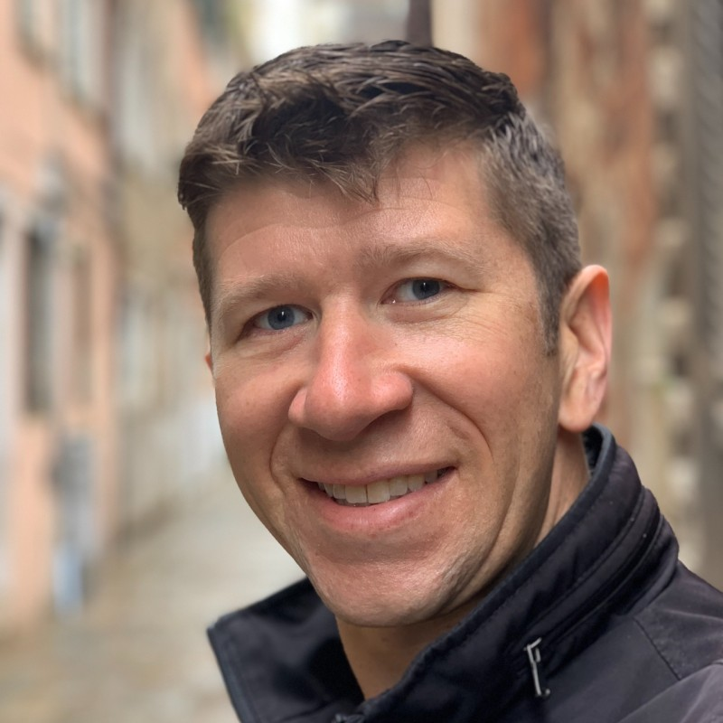
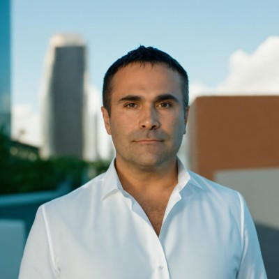
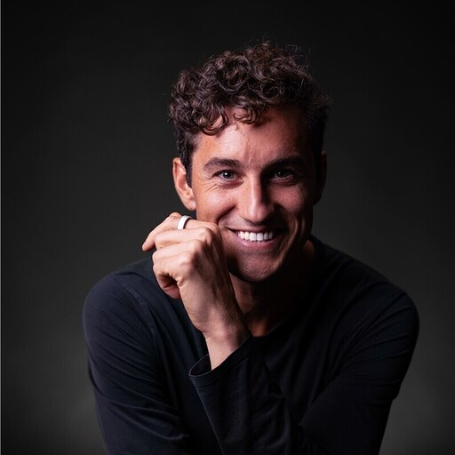

Garrett Rowe Bio

Linkedin:
[<u>https://www.linkedin.com/in/garrettrowe/</u>](https://www.linkedin.com/in/garrettrowe/)

Garrett Rowe is the Founder and CEO of NeuralSeek and an IBM AI
executive whose unique career trajectory spans military service,
enterprise technology, and AI innovation. Beginning his career at 17 in
the US Navy, Garrett flew missions throughout the Pacific, deployed to
Afghanistan, and led the training and readiness program for Navy Region
Southwest, where he designed attack simulations to test base defenses.
This military foundation in complex systems and strategic thinking
provided the groundwork for his dramatic pivot to technology, where he
transitioned from combat boots to corporate suits through a civilian AI
contract role that launched him into IBM.

At IBM, Garrett worked on diverse cutting-edge projects ranging from
smart cities initiatives in Napa Valley to early AI development in
Watson and IBM Cloud. However, his experience revealed a fundamental
flaw in the AI industry: most solutions were assembled in ad-hoc
developer workflows with governance bolted on at the end, producing
projects that were brittle, opaque to auditors, and difficult to defend
in regulated environments. This insight drove him to create NeuralSeek
in 2022, starting with a prototype AI assistant that delivered
real-time, business-driving results for an online gaming company. Today,
NeuralSeek represents his vision of enterprise-grade AI built around an
AI-IDE where developers compose, test, and ship agentic workflows with
governance, observability, and runtime guardrails treated as first-class
capabilities rather than retrofits — the operating model regulated
industries actually need. With 200+ clients, across 21+ countries, his
vision has expanded just as far as his worldly travels.

Marc Martina

Linkedin:
[<u>https://www.linkedin.com/in/marcmartina/</u>](https://www.linkedin.com/in/marcmartina/)

Marc Martina is the Chief Information Officer of NeuralSeek and CEO of
TechD, a comprehensive enterprise Data, ML, and AI firm he has built and
led for over 16 years. His career represents a rare blend of deep
technical architecture expertise and hands-on business leadership,
having grown TechD from the ground up into a trusted partner for
organizations navigating the complex realities of enterprise data and
artificial intelligence. Through nearly two decades at the helm, Marc
has lived the full lifecycle of enterprise AI and data initiatives, from
early machine learning implementations to modern AI-IDE-driven agentic
workflows operating under enterprise governance and regulated-sector
compliance constraints, giving him an unfiltered view of what works,
what breaks, and why most AI projects never make it past the pilot
phase. As both System Architect and Managing Partner, he didn't just
design solutions from a whiteboard; he built them, deployed them, and
stood behind them when they hit production. That dual role across
hundreds of engagements gave him a pattern recognition for enterprise AI
pain points that few in the industry can match.

It was precisely this battle-tested perspective that made the NeuralSeek
opportunity impossible to pass up. When Garrett Rowe approached him with
the early concept for NeuralSeek, Marc immediately recognized the
problem it was solving, the same friction, fragility, and time-to-value
gaps he had witnessed firsthand across years of enterprise AI go-lives.
He jumped at the chance to incubate the product during its infancy,
leveraging TechD's infrastructure and his own architectural expertise to
help shape NeuralSeek from a promising idea into a platform capable of
operating at enterprise scale. Today, as CIO, Marc ensures that
NeuralSeek’s technical foundation reflects the hard lessons of
real-world deployment in regulated sectors — building an AI-IDE where
governance, auditability, lineage, and runtime guardrails are
first-class capabilities of the development workflow rather than
features bolted on for a demo. His 16+ years in the trenches of
enterprise AI aren't just background; they're the operational backbone
that helped NeuralSeek reach 200+ go-lives across 21+ countries.

Lawrence Patrizio

[<u>https://www.linkedin.com/in/larrypatrizio/</u>](https://www.linkedin.com/in/larrypatrizio/)

Lawrence Patrizio rebuilt his life through sustained execution rather
than theory. He transformed his health after college, losing over 100
pounds and committing to endurance training as a long term practice. His
athletic background includes multiple marathons, ultra distance races,
and the Marathon des Sables, a roughly 150 mile ultra marathon across
the Sahara Desert that demands extreme physical preparation, logistics,
and mental discipline. In parallel, he built his professional career by
steadily climbing the ranks of the IBM sales organization over several
years, earning top performer status and was a leader on some of the
firm’s most complex enterprise deals.

Lawrence joined NeuralSeek after discovering the platform as an OEM
product within the IBM software catalog. He was immediately struck by
the speed, flexibility, and practicality of the platform compared to
traditional AI tooling, particularly its ability to deliver
production-grade decision-making AI inside an AI-IDE workflow with
governance, auditability, and runtime guardrails built in from day one —
the combination regulated industries require to move from pilot to live
deployment. As founding Chief Revenue Officer, he has helped shape
NeuralSeek’s go to market strategy, enterprise positioning, and
commercial structure. His work has focused on expanding adoption across
regulated industries, building repeatable sales motions, developing
partner programs, and aligning product capabilities with real
operational use cases.
