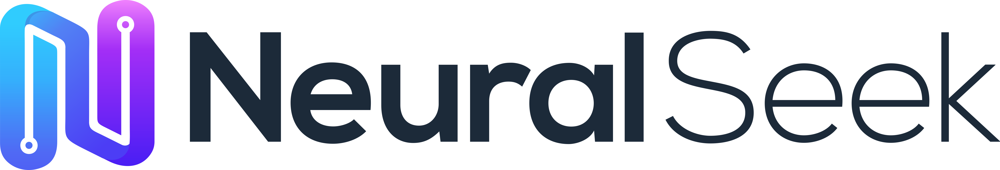
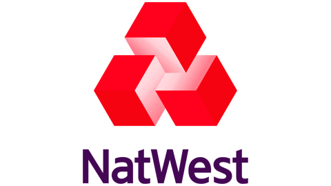
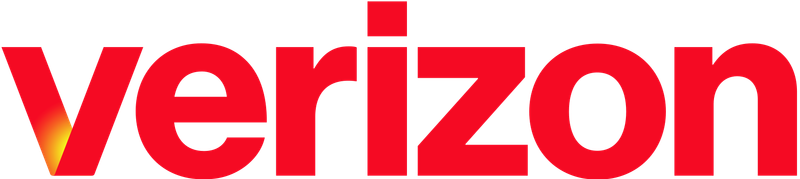
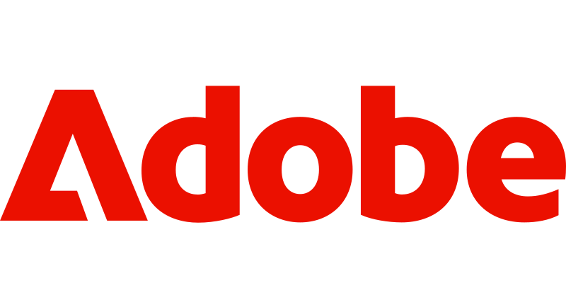
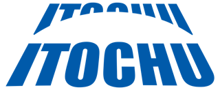
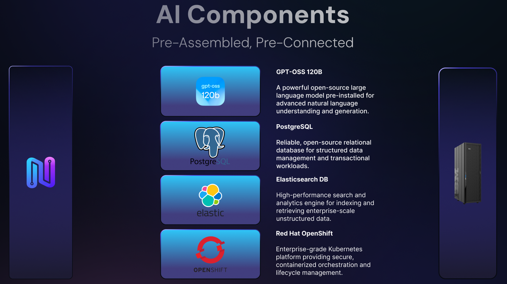
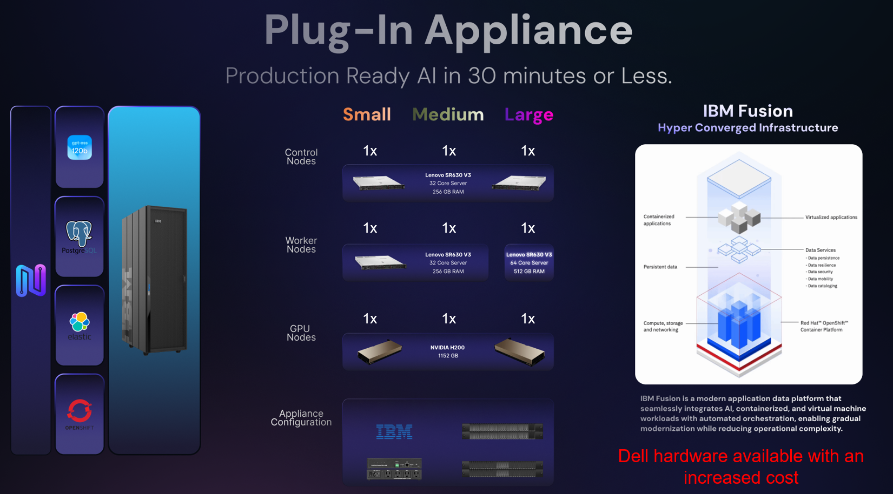

> **Solution Brief**

**<u>NeuralSeek + IBM Fusion</u>**

**Secure, No‑Code AI for Regulated Enterprises**

**<u>Executive Summary</u>**

Enterprises in regulated industries face a fundamental barrier to AI
adoption: **public‑cloud LLMs and SaaS AI agents cannot guarantee data
sovereignty, strict access control, or compliance with frameworks such
as HIPAA, PCI‑DSS, FINRA, GDPR, or CJIS**. Sending prompts or documents
to external endpoints risks exposure of sensitive information, while
multi‑tenant architectures introduce unacceptable uncertainty around
data retention, cross‑customer bleed, and auditability.

**NeuralSeek + IBM Fusion** solves this problem by delivering a fully
governed, behind‑the‑firewall AI platform that transforms private
enterprise data into production‑ready applications—without exposing any
information to external networks. NeuralSeek provides deterministic,
source‑grounded responses, while IBM Fusion enforces policy‑driven
orchestration, identity, and governance. Together, they unlock AI
productivity gains while preserving complete control over data,
workflows, and compliance.

**<u>The Problem: AI Adoption in Regulated Industries</u>**

Boards in banking, insurance, healthcare, government, energy and other
regulated sectors are under pressure to deliver AI productivity — yet
the only readily available options are public, multi‑tenant SaaS LLMs
and AI agents that were never designed for the controls these industries
are legally required to enforce. Sending prompts, documents, customer
records or trade data to an external endpoint is, in many cases, a
regulatory violation in waiting. The result is a widening gap:
**business units are racing ahead with shadow AI while risk, security,
audit and compliance teams are forced to slow or block deployments
because the platforms cannot prove what they did, with what data, on
whose behalf.**

Specifically, regulated organizations are struggling with:

- **Data sovereignty and residency risk** — public‑cloud LLMs route
  prompts, embeddings and uploaded documents through provider
  infrastructure where data location, sub‑processors and training‑reuse
  policies are outside the customer’s control.

- **No zero‑trust enforcement at the model edge** — identity, RBAC,
  group policies and DLP that work for files and databases are bypassed
  the moment a user pastes content into an external chatbot or agent.

- **Hallucinations and non‑deterministic outputs** — LLMs invent
  citations, names, dosages, dollar amounts and legal clauses; in
  regulated workflows a single fabricated fact can trigger fines,
  lawsuits or patient harm.

- **No audit trail or replay** — most SaaS AI services cannot
  reconstruct, on demand, the exact prompt, sources, model, parameters
  and response delivered to a specific user at a specific time — the
  baseline an examiner, regulator or internal auditor will ask for.

- **PII, PHI and trade‑secret leakage** — without inline detection and
  redaction, sensitive content silently flows into prompts, logs and
  analytics caches, creating GDPR, HIPAA, PCI and IP‑exposure incidents.

- **Prompt injection and model abuse** — external chat interfaces are
  increasingly weaponized to exfiltrate data, override system
  instructions, or coax models into unauthorized actions.

- **Vendor lock‑in and retention ambiguity** — single‑model SaaS bundles
  leave organizations unable to swap LLMs for cost or performance, and
  unable to guarantee that content has actually been purged from
  provider systems.

- **Layered compliance exposure** — HIPAA, PCI‑DSS, FINRA, SOX, GDPR,
  CJIS, ITAR, NYDFS, DORA and the EU AI Act each demand evidence that AI
  behavior is bounded, logged and reviewable — something public AI
  tooling is not architected to deliver.

- **Hardware and infrastructure gap** — even when policy allows on‑prem
  AI, most enterprises lack the GPU‑optimized, OpenShift‑ready hardware
  and operational tooling to actually run production LLM workloads
  behind their firewall.

The takeaway is straightforward: regulated industries do not need
another general‑purpose chatbot. They need an AI platform that operates
**inside their own security perimeter, on hardware they trust, with
governance and evidence built in at every layer.**

**<u>What NeuralSeek Provides</u>**

NeuralSeek is a **no‑code, LLM‑agnostic enterprise AI platform** that
lets business users and IT teams transform private data into governed,
production‑ready AI agents and workflows — without exposing data to
external networks, fine‑tuning models on customer content, or writing
orchestration code. It is purpose‑built for the controls regulated
industries require, and is the same platform trusted today by NatWest,
Verizon, Adobe, Snap, BROU, AFP Capital, Penn State and dozens of other
regulated organizations.

**1. No‑Code RAG and Multi‑Agent Orchestration**

NeuralSeek connects to your existing knowledge bases, file shares,
SharePoint, Confluence, Salesforce, Workday, ServiceNow, vector stores,
relational databases and APIs, and delivers retrieval‑augmented,
source‑grounded answers through drag‑and‑drop agent design. Agents can
call other agents, route between models, and execute multi‑step business
workflows — all configured by domain experts, not engineers.

**2. Multi‑LLM Routing and BYO‑Model**

NeuralSeek is LLM‑agnostic. It orchestrates across IBM Granite, watsonx,
OpenAI, Azure OpenAI, Anthropic, Google, AWS Bedrock, open‑source
models, and self‑hosted LLMs running on your own GPUs. Each agent can
route between models on a per‑task basis to optimize for accuracy,
latency, cost or data‑residency — with no application rewrites and no
vendor lock‑in.

**3. Deterministic, Source‑Grounded Answers**

Every response is tied back to approved internal sources with verifiable
citations, semantic confidence scoring, and configurable attribution
protection. Low‑confidence outputs are automatically suppressed,
escalated, or routed to a human—eliminating the silent hallucinations
that disqualify generic LLMs from clinical, legal, financial and
operational use.

**4. Three Layers of Built‑In Governance**

NeuralSeek delivers governance as a first‑class capability, not an
afterthought:

- **AI Guardrails** — real‑time PII/PHI detection and redaction (flag,
  mask, hide or delete), prompt‑injection defense, profanity filtering,
  semantic scoring, and attribution protection that block unsafe outputs
  before they reach a user.

- **LLM Governance** — token‑level cost tracking per query, agent and
  department; model‑to‑model cost and quality benchmarking; configurable
  confidence thresholds; and full replayable logs of every prompt,
  retrieval, model call and response.

- **Platform Governance** — a unified governance dashboard surfacing
  intent analytics, documentation coverage, access logs, configuration
  state and system health across every agent and instance.

**5. Enterprise Identity and Access Control**

SSO via SAML 2.0, plus native Okta, Active Directory and LDAP
integration. Directory groups map to NeuralSeek roles, with real‑time,
per‑document permissions checks against source systems (Confluence,
SharePoint, file shares) before any content is passed to an LLM — so
users only ever see answers grounded in data they are authorized to
access.

**6. Deployment Flexibility — SaaS, Private Cloud, or Fully On‑Prem**

NeuralSeek deploys as containers on Red Hat OpenShift or Kubernetes and
is engineered to run fully air‑gapped behind the customer firewall — the
mode required for FedRAMP, HIPAA, CJIS, ITAR and EU‑sovereign workloads.
When paired with IBM Fusion, every token, retrieval and log remains
inside your data center.

**7. Safe Use of Private Data Without Model Retraining**

NeuralSeek retrieves and reasons over private data in real time. It does
not fine‑tune external models on your content, does not share customer
data with sub‑processors for training, and does not require costly
retraining cycles when knowledge changes — update the source, and the
agent’s answers update with it.

**<u>What IBM Fusion Provides</u>**

IBM Fusion HCI is a **turnkey, hyperconverged hardware appliance** that
delivers a proven, enterprise‑grade foundation for running production AI
workloads on‑premises and behind the firewall. Where most "on‑prem AI"
projects stall on DIY GPU clusters, brittle Kubernetes stacks and
unvalidated storage, Fusion HCI arrives as a single, factory‑integrated
rack of compute, GPU, storage and networking, pre‑installed with Red Hat
OpenShift on bare metal and ready for AI workloads in hours rather than
weeks.

**1. Purpose‑Built Hardware Foundation for On‑Prem AI**

Fusion HCI integrates compute, storage and networking with Red Hat
OpenShift in a single, AI‑optimized appliance — removing the complexity
of DIY clusters and giving regulated enterprises a **vetted, supportable
hardware stack** on which to standardize their AI estate. Each rack
supports up to four GPU server nodes — NVIDIA H100 NVL, NVIDIA L40S or
AMD Instinct MI210 — sized for LLM inference, fine‑tuning and agentic AI
pipeline acceleration.

**2. Bare‑Metal Red Hat OpenShift, Automated Installer**

OpenShift runs natively on bare metal across Fusion HCI worker, GPU and
storage nodes — no nested virtualization tax, no separate hypervisor
licenses. The automated installer deploys a production‑ready OpenShift
cluster, gives platform teams a single management plane for containers
and VMs side‑by‑side, and is the same operating environment NeuralSeek
installs into.

**3. Tight Integration with IBM watsonx and Granite**

Fusion HCI is the IBM‑validated platform for running watsonx.ai,
watsonx.data and watsonx.governance on‑premises, accelerated by NVIDIA
L40S and H100 GPUs and IBM’s high‑speed distributed cache for HPC‑class
data access. Granite and open‑source LLMs can be hosted directly on the
appliance and consumed by NeuralSeek with zero egress.

**4. Data Resilience and Cyber Resilience**

Data is encrypted at rest and in flight, and protected by an
erasure‑coding algorithm resilient to double‑node failures. Integrated
backup and restore covers both application persistent volumes and VMs to
on‑rack and off‑rack targets, and Fusion HCI’s Metro‑DR feature provides
synchronous replication between availability zones for the recovery
objectives auditors and regulators expect.

**5. Hardware‑Rooted Trust and Isolated Compute**

Because the entire AI stack — hardware, OS, OpenShift, models, vector
store and NeuralSeek orchestration — lives inside one supported
appliance behind the customer firewall, organizations get
hardware‑rooted trust, fully auditable supply chain, and the
data‑sovereignty posture required for FedRAMP, GovCloud, HIPAA, CJIS,
ITAR, GDPR and EU‑AI‑Act workloads.

**6. Single Pane of Glass for the AI Estate**

Fusion provides a unified dashboard for compute, storage, networking,
container and VM workloads across on‑prem and hybrid cloud deployments.
Combined with NeuralSeek’s Platform Governance layer, security and GRC
teams get consolidated visibility from the silicon all the way up to the
prompt.

**<u>Joint Value Proposition: NeuralSeek + IBM Fusion</u>**

Together, NeuralSeek and IBM Fusion deliver one of the only
architectures capable of meeting the full stack of requirements demanded
by regulated industries: **security, governance, accuracy, auditability,
hardware assurance, and operational control**. NeuralSeek solves the
correctness, governance and developer‑velocity problem; Fusion solves
the data‑sovereignty and infrastructure problem. The combination is
greater than the sum of its parts:

**1. Absolute Data Sovereignty and Privacy**

When NeuralSeek is deployed on Fusion HCI, every prompt, retrieval,
embedding, log and response stays inside your data center. No external
API calls. No third‑party data exposure. No multi‑tenant cloud risk. No
external retention or training‑reuse. The architecture is auditable down
to the hardware.

**2. Deterministic, Source‑Grounded, Auditable Answers**

NeuralSeek ties every response to approved internal sources with
semantic confidence scoring, attribution protection and verifiable
citations. Fusion provides the resilient, high‑performance storage and
compute layer that makes those retrievals fast enough for production.
The result: explainable, replayable AI that legal, clinical, financial
and operational teams can defend.

**3. Three‑Layer, Defensible Governance**

NeuralSeek’s AI Guardrails, LLM Governance and Platform Governance
combine with Fusion’s identity, encryption, RBAC and audit telemetry to
give risk, audit and compliance teams a single, end‑to‑end control plane
— from token cost to model behavior to underlying hardware health.

**4. Compliance‑Ready by Design**

The combined stack is architected to support the strictest regulatory
regimes — HIPAA, PCI‑DSS, FINRA, SOX, GDPR, CJIS, ITAR, NYDFS, DORA and
the EU AI Act. NeuralSeek enforces content‑level compliance (PII,
attribution, replay, RBAC); Fusion enforces system‑level compliance
(encryption, sovereignty, resilience, supply chain).

**5. Production AI Without Model Retraining or Data Movement**

NeuralSeek retrieves and reasons over enterprise data in real time — no
fine‑tuning of external models on customer content, no costly training
pipelines. Fusion keeps that data co‑located with the GPUs and the
model, so latency, cost and governance are all optimized at once.

**6. Seamless Integration with Internal Systems**

Through Fusion’s OpenShift foundation and NeuralSeek’s connector
library, agents securely reach into databases, file shares, SharePoint,
Confluence, Salesforce, Workday, ServiceNow, identity systems
(LDAP/AD/SAML/SSO) and line‑of‑business applications — reasoning and
acting inside the customer’s environment, not around it.

**7. Multi‑LLM Flexibility, No Vendor Lock‑In**

Customers can run IBM Granite and watsonx side‑by‑side with open‑source
and commercial LLMs on Fusion’s GPUs, and let NeuralSeek route between
them per‑task. As models, prices and capabilities evolve, applications
adapt without rewrite.

**8. Faster Time‑to‑Production for Regulated AI**

Fusion eliminates months of infrastructure work; NeuralSeek’s no‑code
agent design eliminates months of orchestration code. What previously
required an army of cloud architects, ML engineers and compliance
reviewers can be delivered by a small joint team — measured in weeks,
not quarters.

**Trusted by leading regulated enterprises worldwide**

|  |  |  |  |  |  |  |  |
|----|----|----|----|----|----|----|----|

**<u>Use Cases Across Industries</u>**

NeuralSeek + IBM Fusion is already in production across the most
regulated and complex sectors of the global economy. The use cases below
reflect both **proven NeuralSeek deployments at named enterprise
customers** — including new engagements with Children’s Health
(pediatric healthcare), Great Day Improvements (home services), and
ITOCHU International (global trading) — and the broader set of workflows
that the joint stack is uniquely positioned to deliver behind the
firewall.

**Healthcare and Life Sciences**

**Children’s Health — five enterprise AI use cases inside a top‑ranked
pediatric system.** Children’s Health, the leading pediatric health
system in North Texas (~\$3B revenue, 8,000+ clinicians and staff), is
deploying NeuralSeek as a unified AI platform inside its own controlled
environment — with role‑based access, full audit logging, PHI‑aware
content filtering, and integration to existing IAM. CTO David Seo: “Most
AI platforms promise HIPAA compliance, but NeuralSeek actually delivers
with granular role‑based access, full audit logging, and content
filtering built specifically for pediatric care. The fact that
everything stays within our own infrastructure while still being
accessible to our clinical teams is exactly what we needed.”

- **Clinician‑ and staff‑facing HIPAA‑aware chatbot** — a ChatGPT‑style
  assistant running inside Children’s tenant with SSO, RBAC scoped to
  each user’s role and unit, content filtering tuned for pediatric care,
  and a full audit trail on every prompt and response.

- **Clinical policy and pathway chat with cited answers** — pre‑loaded
  with Children’s clinical pathways, pediatric medication protocols
  (including weight‑based dosing), infection‑prevention standards, and
  regulatory guidance; clinicians get direct citations to the source
  policy and paragraph, auto‑refreshed when policy is republished, with
  PHI guardrails blocking restricted disclosures.

- **OCR for referral packets and scanned charts** — outside records,
  faxed referrals, handwritten intake forms, imaging reports and legacy
  scanned charts are OCR’d in place and brought directly into the chat
  for inline summarization and Q\&amp;A.

- **Self‑service pediatric cohort analytics** — quality, operations and
  research teams ask plain‑English questions of governed datasets
  (readmission, length of stay, NICU throughput, ED wait times, outcomes
  by age band) with the underlying query and source data surfaced for
  audit.

- **Family and caregiver call analytics** — AI‑driven insight on every
  inbound call from families, referring providers, scheduling and nurse
  lines — surfacing caregiver distress signals, booking friction and
  coaching moments across the full volume, not just a QA sample.

Beyond Children’s Health, NeuralSeek is also deployed across other
healthcare and life‑sciences workloads:

- **Medical education and clinical content production** — AdMed uses
  NeuralSeek’s no‑code AI orchestration to accelerate creation of
  pharmaceutical and biotech training content while preserving clinical
  accuracy and compliance.

- **Pharmaceutical R\&amp;D and regulatory drafting** — grounded
  summarization of trial protocols, IND/NDA submissions and medical
  literature with verifiable citations — critical for FDA and EMA
  submissions.

- **PHI‑safe back‑office assistants** — with NeuralSeek’s real‑time PHI
  detection and redaction running on Fusion HCI inside the hospital
  firewall, providers can deploy HIPAA‑compliant assistants for coders,
  schedulers and patient services without sending PHI to external
  models.

**Banking, Financial Services and Investment Research**

- **Public‑facing AI banking assistants under GDPR** — NatWest’s Cora+
  pilot uses NeuralSeek’s RAG, AI Guardrails, replay and granular
  governance to deliver conversational banking answers across web,
  mobile and online channels with full GDPR‑grade traceability.

- **Investor relations and earnings‑call preparation** — Verizon uses
  NeuralSeek AI agents to anticipate analyst questions, cross‑reference
  transcripts and disclosures, and generate context‑rich draft responses
  for executive review ahead of earnings calls.

- **On‑prem AI for tier‑1 banks** — BROU, the largest bank in Uruguay,
  runs NeuralSeek on‑premises to power internal knowledge search across
  over one million clients’ worth of processes and policies, with
  governance and audit logging suitable for central‑bank scrutiny.

- **Multi‑channel customer service for pensions and payments** — AFP
  Capital (Chile) and Clip (Mexico) use NeuralSeek to deliver
  consistent, policy‑compliant answers across IVR, WhatsApp, web and
  internal support, handling thousands of concurrent interactions while
  keeping regulators satisfied.

- **AML, fraud and KYC support agents** — dedicated, policy‑aligned
  agents route sensitive inquiries through OCC/FINRA/FDIC/FFIEC‑aware
  guardrails with full decision auditability.

**Industrial, Trading and Diversified Enterprises**

**ITOCHU International — 107‑agent hybrid RAG financial intelligence for
a Fortune Global 500 trading house.** ITOCHU International, one of
Japan’s "big‑5" sogo shosha (~\$90B annual revenue, 120,000+ employees,
operations across 60+ countries), partnered with NeuralSeek to build
**Itochu Insight** — a hybrid RAG financial intelligence platform
combining SEC EDGAR filings, live web research and private documents,
orchestrated through a graph of **107 specialized agents**, and deployed
inside ITOCHU’s existing Azure tenant with Microsoft Entra SSO,
JWT‑validated sessions and per‑tenant document isolation. Director, IT
Strategy Tony Chang: “The speed and flexibility of their low‑code,
no‑code development platform stand out. We were able to leverage our
Azure cloud infrastructure effectively, and the deep research in full
mode is quite fast. The ability to make quick fine‑tuning changes has
been especially helpful for the project.”

- **Hybrid RAG financial intelligence** — a unified retrieval layer
  blending SEC EDGAR filings, live web research and ITOCHU’s private
  documents, using BM25 plus dense vectors to keep answers precise
  whether the source is a 10‑K footnote or an uploaded PDF.

- **107‑agent LangGraph orchestration** — a Main Orchestrator that
  resolves a company and fans out to ingestion, search and analysis
  sub‑agents, plus a Reports Orchestrator that drives the Summary,
  Longitudinal, Risk and Peer Comparison decks through parallel section
  agents with a shared variable store.

- **5‑year XBRL financial dashboard** — revenue, margins, EBITDA and ROE
  pulled directly from SEC EDGAR XBRL with YoY deltas and per‑metric
  trend charts, each metric documenting its source filing (10‑K / 20‑F /
  40‑F / 10‑Q / 6‑K) and whether it was reported or derived.

- **Cited, multi‑source analyst chat** — Quick Scan and Deep Research
  modes blend SEC filings, web research and uploaded documents, with
  inline source attribution so reasoning is auditable back to the
  original artifact.

- **Deterministic PDF and editable PPTX report generation** — the
  Reports Orchestrator assembles four deck types and deterministically
  stitches them into polished PDFs and editable PowerPoint files,
  drop‑in‑ready for an analyst workflow.

**Insurance**

- **Underwriting and claims acceleration** — LLM‑enhanced OCR ingests
  scanned policies, claims forms and medical records, extracts entities
  with contextual meaning, and routes them through governed downstream
  workflows.

- **Agent‑and‑broker enablement** — grounded answers to product,
  eligibility and regulatory questions, sourced from approved internal
  knowledge with full audit trail.

**Government and Public Sector**

- **Air‑gapped, sovereign AI for federal, state and local agencies** —
  NeuralSeek runs fully on‑premises on Fusion HCI to satisfy FedRAMP,
  GovCloud, CJIS and ITAR controls, with no external dependency on
  public LLM providers.

- **Citizen services and benefits navigation** — grounded,
  policy‑compliant assistants help residents find programs, complete
  forms and understand eligibility, with PII redaction enforced inline.

- **Defense and intelligence knowledge augmentation** — multi‑model
  agents reason over classified knowledge bases inside isolated
  enclaves, with full prompt/response replay for oversight.

**Higher Education**

- **University‑scale digital concierges** — Penn State’s MyResource,
  built on NeuralSeek, serves nearly 90,000 students with personalized
  access to academic, health, wellness and financial aid resources —
  grounded in university data and protected by harmful‑language and
  sensitive‑data filtering.

- **Research administration and grants** — grounded assistants for
  research compliance, IRB workflows and grant documentation — with
  citations to institutional policy.

**Home Services, Retail and Consumer Brands**

**Great Day Improvements — multi‑LLM, multi‑line‑of‑business AI
assistant for HR and the Call Center.** Great Day Improvements, a top‑5
U.S. direct‑to‑homeowner home‑improvement platform (~\$1B+ combined
revenue, 3,000+ employees, multi‑brand family including Patio
Enclosures, Champion and Stanek), is deploying **yETI** on NeuralSeek —
a ChatGPT‑style chat experience covering HR and the Call Center, with
multi‑LLM selection, authenticated SSO‑scoped sessions, document upload
and analysis, chat history and context, Great Day’s internal PDFs and
Word documents pre‑indexed for RAG, and end‑to‑end deployment inside
Great Day’s existing Azure tenant — with no data leaving the customer’s
environment. A Phase II roadmap extends yETI into Great Day’s Databricks
datalake with OAuth/SAML SSO and richer CSV/Excel/PDF/Word ingestion so
analysts can reason over structured datasets alongside the existing
corpus. CTO Soo‑Jin Behrstock: “It feels like a working session, not a
vendor relationship. When we bring up a use case, they work through it
with us and quickly turn it into something real we can see and react to.
That ability to move from idea to proof of concept fast has made a big
difference for us internally.”

**Enterprise HR, IT and Internal Operations**

- **AI‑powered HR assistants** — Snap’s "Chilla" Slack bot, powered by
  NeuralSeek, is a centralized HR assistant with strict guardrails,
  contextual awareness by country/city, and workflow integration
  (Workday, Zendesk, onboarding nudges) for a globally distributed
  workforce.

- **Automated HR inbox triage and Center‑of‑Excellence for Agentic AI**
  — Adobe uses NeuralSeek to triage HR inbox traffic, unify knowledge
  across emails/messages/documents, and run a hub‑and‑spoke CoE where
  business users build agents in no‑code while IT governs centrally.

- **Multi‑LLM employee chat with call‑center grounding** — as
  demonstrated at Great Day Improvements (above), NeuralSeek delivers a
  secure, authenticated, multi‑LLM chat experience that spans HR policy
  Q\&amp;A and call‑center workflows in a single governed platform
  inside the customer’s own cloud tenant.

- **IT helpdesk, ITSM and developer enablement** — grounded answers over
  Confluence, SharePoint, ServiceNow and code repositories with
  real‑time, per‑document permissions enforcement.

**Cross‑Industry Production Patterns**

- **AI‑powered PDF research and reports** — parallel retrieval from
  internal knowledge and approved external sources synthesized into
  citation‑rich PDFs, as productionized in the ITOCHU Reports
  Orchestrator.

- **SQL‑to‑PowerPoint and analyst‑deck automation** — NeuralSeek queries
  the warehouse, drafts charts and slides, and assembles a complete deck
  — with governance applied to every metric cited and inline source
  attribution on every claim.

- **Client‑ready email and Slack automation** — Slack‑triggered drafting
  with confidence checks and human‑in‑the‑loop escalation for
  low‑confidence responses.

- **Daily meeting and account briefings** — generated from calendar
  events, CRM data and approved internal sources, tailored per executive
  and replayable on audit.

- **Air‑tight virtual assistants behind the firewall** — downloadable,
  self‑hosted AI‑agent factories built on NeuralSeek + open‑source LLMs
  running on Fusion HCI — the answer to "ChatGPT‑like UX without the
  data‑leakage risk."

**<u>Architectual Overview & Diagram</u>** (Marc to
provide)

<u>**Guidelines & Sizing Recommendations**</u>
(Marc/Lawrence to provide)

NeuralSeek + IBM Fusion HCI is offered in three pre‑configured tiers —
**SMALL (E01), MEDIUM (E03) and LARGE (E05)** — sized to match the
customer’s expected agent concurrency, model footprint, retrieval volume
and storage requirements. All three tiers ship as a single,
factory‑integrated rack running Red Hat OpenShift on bare metal, with
NeuralSeek installed as containers on top.

**Hardware Configuration by Tier**

| **Fusion HCI Component** | **SMALL (E01)** | **MEDIUM (E03)** | **LARGE (E05)** |
|----|:--:|:--:|:--:|
| Control Nodes (C10) | 3 | 3 | 3 |
| Worker Nodes (C10) | 3 | 3 | 0 |
| Worker Nodes (C14) | 0 | 1 | 4 |
| GPU Nodes (G03) | 1 | 1 | 2 |
| GPUs per G03 (NVIDIA H100 NVL) | 2 | 4 | 4 |
| Total Worker vCPUs | 288 | 416 | 704 |
| Total Worker Memory (GB) | 1,536 | 2,560 | 5,632 |
| NVMe Drives (2 per node, 3.84 TB) | 12 | 14 | 14 |
| Total Raw Storage (TB) | 46 | 54 | 54 |
| Available Usable Storage (TB) | 14 | 16 | 16 |

All tiers include a Lenovo service node, dual high‑speed and dual
management switches, dual PDUs and dual 24 A power cords as part of the
rack base configuration. GPU selection above reflects the standard
sizing assumption (NVIDIA H100 NVL); NVIDIA L40S and AMD Instinct MI210
are also supported per IBM Fusion HCI specifications.

**Indicative Pricing by Tier (USD, Net of Discount)**

| **Component** | **SMALL (E01)** | **MEDIUM (E03)** | **LARGE (E05)** |
|----|:--:|:--:|:--:|
| Fusion HCI compute/storage/GPU nodes (Net + per‑node shipping) | \$389,497 | \$552,773 | \$884,794 |
| Fusion HCI base rack: rack, service node, switches, PDUs, freight (Net) | \$115,047 | \$115,630 | \$125,763 |
| Fusion HCI Software (Net) | \$93,836 | \$135,542 | \$229,378 |
| Premium Support — Net (Year 1 TAM) | \$48,333 | \$68,831 | \$111,417 |
| **Total Fusion HCI Configuration — Net** | **\$646,714** | **\$872,776** | **\$1,351,353** |
| NeuralSeek License — Option 1 (Perpetual) | \$300,000 | \$600,000 | \$900,000 |
| **Combined — Fusion HCI + NeuralSeek Perpetual** | **\$946,714** | **\$1,472,776** | **\$2,251,353** |
| NeuralSeek License — Option 2 (Annual Subscription) | \$150,000 | \$300,000 | \$450,000 |
| **Combined Year 1 — Fusion HCI + NeuralSeek Subscription** | **\$796,714** | **\$1,172,776** | **\$1,801,353** |

Pricing reflects net figures after applicable IBM and NeuralSeek
discounts as modeled in the current joint sizing workbook (May 2026),
inclusive of freight. Final customer quotes will reflect negotiated
terms, tax, multi‑year support elections, currency, and any optional
add‑ons (additional memory, 7.68 TB drives, NVIDIA NVLink, L40S GPUs,
LVM drives). The combined total under the subscription option is for
Year 1; subsequent years carry only the NeuralSeek subscription plus
Fusion HCI premium‑support renewals.

**How to Choose a Tier**

- **SMALL (E01)** — single department, focused pilot or production
  rollout of one or two agentic workflows; up to a few hundred
  concurrent users; one GPU node (2× H100 NVL) for inference; ~14 TB
  usable storage. Good fit for a first on‑prem NeuralSeek + Fusion
  deployment or a regulated business unit standing up its own AI
  environment.

- **MEDIUM (E03)** — enterprise‑wide deployment for a mid‑sized
  regulated organization, multiple agent families across
  HR/IT/operations/compliance; thousands of concurrent users; one GPU
  node with 4× H100 NVL for higher inference throughput; ~16 TB usable
  storage.

- **LARGE (E05)** — multi‑LOB, multi‑tenant deployment for tier‑1 banks,
  health systems, federal/state agencies and global enterprises; two GPU
  nodes (8× H100 NVL combined); 5.6 TB of worker memory for large‑model
  inference and fine‑tuning; the configuration assumed for production
  air‑gapped workloads.

All three tiers can scale horizontally by adding GPU and worker nodes to
the rack, and additional Fusion HCI racks may be federated for
multi‑region or DR architectures. Contact the joint NeuralSeek + IBM
team for custom sizing against specific concurrency, model and storage
targets.

**<u>Conclusion</u>**

NeuralSeek + IBM Fusion is one of the few architectures capable of
meeting the full stack of requirements demanded by regulated industries:
**security, governance, accuracy, auditability, and operational
control**. NeuralSeek solves the correctness and explainability problem;
Fusion solves the data‑sovereignty and governance problem. Together,
they enable enterprises to move from prototypes to **production‑grade AI
systems that regulators, auditors, and risk committees can trust**.
